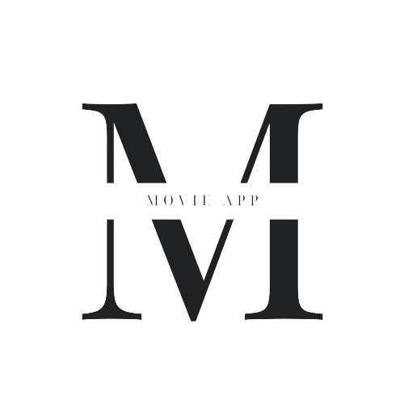

  
  <h3 align="center">Movie App</h3>

[]
[]

## Architecture

Movie App was built to run on iOS, Android.

### Libs

- [react-navigation](https://github.com/react-navigation/react-navigation)
- [react-native-bootsplash](https://github.com/zoontek/react-native-bootsplash)
- [react-native-ratings](https://github.com/Monte9/react-native-ratings)
- [eact-native-skeleton-placeholder](https://github.com/chramos/react-native-skeleton-placeholder)
- [react-native-vector-icons](https://github.com/oblador/react-native-vector-icons)

### APIs

- [TMDb](https://developers.themoviedb.org/3/getting-started/introduction)

## Running locally

As others projects, you will need some requirements to run:

#### Requirements

- [Node.js](https://nodejs.org/) (LTS)
- [Yarn](https://yarnpkg.com/) (LTS)

#### How to run

- `git clone https://github.com/Khusnijafar/Movie-App-Test.git`
- `yarn install`
- `cd ios and pod install` (iOS only)

Now, you can choose a command to run the project:

- `yarn ios` to run on iOS simulator
- `yarn android` to run on Android simulator

